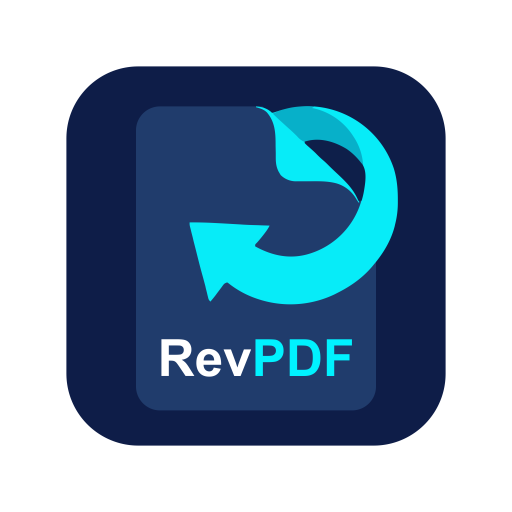
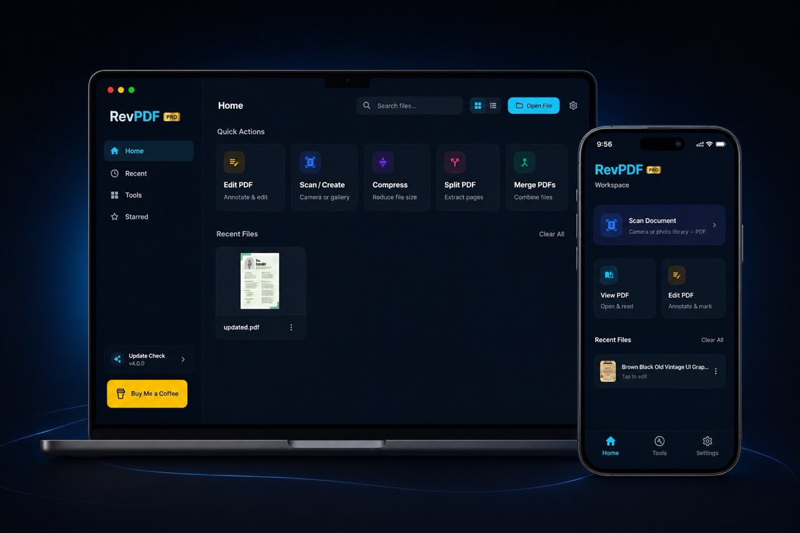

#  revpdf-release

Official release repository for **revpdf** — a fast, native, and privacy-focused offline PDF editor.

[**Download for Android**](https://play.google.com/store/apps/details?id=com.revpdf.editor) | [**Official Website**](https://www.revpdf.com)

---

### ✨ Features
- **Fast & Native**: Built for performance with a clean, intuitive editor.
- **Privacy First**: Offline processing. No sign-up, no cloud, no data tracking.
- **Advanced Tools**:
  - ✂️ **Split**: Extract pages or split by range.
  - 🤝 **Merge**: Combine multiple PDFs into one.
  - 🗜️ **Compress**: Reduce file size without losing quality.
  - 🖼️ **Export to Images**: Convert PDF pages to high-quality images.
  - 📄 **From Images**: Create PDFs from your photos.
  - ... and more!

---

### 📥 Downloads

Select your platform below to download the latest stable release:

#### 🐧 Linux
- [Latest AppImage](https://github.com/Pawandeep-prog/revpdf-release/releases/latest)

#### 🍎 macOS
- [Latest DMG](https://github.com/Pawandeep-prog/revpdf-release/releases/latest)

#### 🪟 Windows
- [Latest Beta (exe)](https://github.com/Pawandeep-prog/revpdf-release/releases/latest)

---

*For support or feedback, visit our [website](https://www.revpdf.com).*
